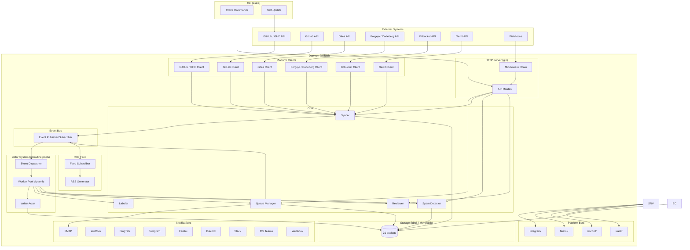
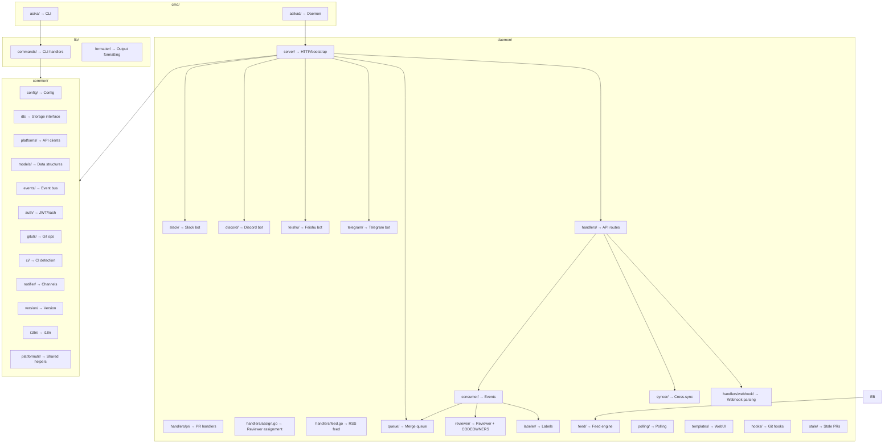

## Architecture



### Middleware Chain

Request processing order:

1. **initCheckMiddleware** — Redirects to `/wizard` if server not initialized
2. **LocaleMiddleware** — Detects language from cookie or Accept-Language header
3. **Logger** — Request logging via slog
4. **Recovery** — Panic recovery
5. **MetricsMiddleware** — Request counting and latency tracking
6. **CORS** — Cross-origin resource sharing
7. **RateLimit** — Per-IP token bucket (optional)
8. **AuthMiddleware** — JWT/cookie authentication

Route-specific middleware:

- `RequireRole(role)` — Checks role hierarchy (admin > operator > viewer)
- `RequireAnyRole(roles...)` — Checks if user has any of the listed roles
- `RequirePermission(field)` — Checks granular permission (can_approve, can_merge, can_close, can_reopen, can_spam, can_manage_queue, can_revert)
- `RequireRepoGroupAccess()` — Checks user's allowed repo groups against URL parameter; also supports API key `AllowedRepoGroups`
- `RequireRepoAccess()` — Finer-grained check: resolves the actual `owner/repo` from the PR record and checks against user's `AllowedRepos` list

### Permission Model

Three-tier role hierarchy with six granular permissions:

| Permission | viewer | operator | admin |
|------------|--------|----------|-------|
| View PRs | ✅ | ✅ | ✅ |
| Approve PRs | ❌ | Configurable | ✅ |
| Merge/Rebase | ❌ | Configurable | ✅ |
| Close PRs | ❌ | Configurable | ✅ |
| Reopen PRs | ❌ | Configurable | ✅ |
| Mark Spam | ❌ | Configurable | ✅ |
| Manage Queue | ❌ | Configurable | ✅ |
| Revert PRs | ❌ | Configurable | ✅ |
| User Management | ❌ | ❌ | ✅ |
| Config Management | ❌ | ❌ | ✅ |

Non-admin users can be assigned to specific repo groups and repos:
- `AllowedRepoGroups []string` — empty = access to all groups (backward compatible)
- `AllowedRepos []string` — empty = access to all repos; format: `"owner/repo"`; resolved from PR record at request time

Both fields are supported on `User` (JWT auth) and `APIKey` (API key auth).

Temporary tokens: Users can generate short-lived JWT tokens (1m–24h) with a `temp: true` claim and a `permissions` map. `RequirePermission` middleware checks temp token permissions before falling through to DB permissions. Generated via `POST /api/v1/auth/temp-token`.

### Background Workers

- **Queue Checker** — Every 30s, checks all queue items for merge readiness (approvals, CI, conflicts). Items with a future `ScheduleAt` time are skipped until the scheduled time arrives.
- **Spam Detector** — Scans for spam PRs based on author frequency and title keywords
- **Spam Auto-Clean** — Periodically clears spam keywords and resets author trigger (configurable interval)
- **Poller** — Fetches PRs from platforms at configured intervals (polling mode)
- **Event Consumer** — Dispatches events from the event bus to the worker pool
- **Stale Checker** — Periodically checks for and handles stale PRs
- **Webhook Retry Worker** — Retries failed webhook deliveries with exponential backoff
- **Webhook Health Checker** — Every 2 minutes, checks `webhook_health` bucket per repo group/platform. If no webhook received within threshold, enables forced polling for that repo group (auto-fallback).
- **Serial Validation Worker** — Processes `serial_queue` bucket items through validation state machine: rebase onto latest main → re-validate CI → mark merge-ready. Prevents post-merge CI failures.
- **Escalation Worker** — Hourly scans open PRs, calculates priority from labels + file paths, sends tiered notifications: reviewer → team → tech_lead based on priority and time open.
- **Feed Subscriber** — Subscribes to the event bus, feeds PR events (opened/merged/closed/approved/reopened) into the in-memory ring buffer for RSS generation.

### Reviewer Auto-Assignment

The reviewer system assigns reviewers to PRs automatically through two mechanisms:

1. **Review Rules** — Pattern-based rules (file path, title, author) defined globally (`[review_rules]`) or per-repo-group (`[[repo_groups.review_rules]]`). Group rules are merged with global rules, sorted by priority. Reuses the labeler's `MatchRule()` engine with `file:`, `title:`, `author:` scope prefixes.

2. **CODEOWNERS** — When no review rules match, the system fetches a CODEOWNERS file from the repository (tries `CODEOWNERS`, `.github/CODEOWNERS`, `.gitlab/CODEOWNERS`, `docs/CODEOWNERS`). Parsed with GitHub-style last-match-wins semantics. Results are cached in-memory with a 5-minute TTL.

Trigger flow: webhook/poller → event bus → consumer → `reviewer.HandlePROpenedWithCodeOwners()` → platform API `RequestReview()`.

Manual assignment endpoints:
- `POST /api/v1/repos/:repo_group/prs/:pr_id/assign` — Manually assign reviewers (requires `approve` permission)
- `POST /api/v1/repos/:repo_group/prs/:pr_id/codeowners-assign` — Re-evaluate CODEOWNERS and assign (requires `approve` permission)

### RSS Feed

The RSS feed provides a pull-based stream of PR activity:

- `GET /api/v1/feed.xml` — Global RSS feed (all repo groups). Append `?repo_group=<name>` to filter.
- `GET /api/v1/feed/config` — View feed configuration (admin only)
- `PUT /api/v1/feed/config` — Update feed configuration (admin only)

Feed configuration (`[feed]` TOML section):
```toml
[feed]
enabled     = true
title       = "Asika PR Feed"
max_items   = 50
public_feed = false
```

Feed items are stored in an in-memory ring buffer (default 50 items max). The feed subscriber consumes events from the event bus: `pr_opened`, `pr_merged`, `pr_closed`, `pr_approved`, `pr_reopened`.

### Actor System (Goroutine Pools)

The event consumer uses an Actor-model architecture with goroutine pools for concurrent processing:

- **Event Dispatcher** — Single goroutine reads from the event bus and dispatches events to the worker pool
- **Worker Pool** — Dynamic pool of goroutines processing events concurrently. Scales between `min_workers` (default 2) and `max_workers` (default 8) based on channel utilization. Scale up when >= `scale_up_pct` (default 75%), scale down when <= `scale_down_pct` (default 25%), with cooldown (default 30s) to prevent thrashing. Configurable via `[worker_pool]` TOML section, hot-reloadable at runtime.
- **Writer Actor** — Dedicated goroutine serializing all bbolt writes through a channel (buffer=256). Eliminates write contention since bbolt requires serialized transactions
- **Event Bus** — Blocking publish with backpressure (no silent event drops)
- **Pool Metrics** — Tracks worker count, total/active tasks, utilization%, scale up/down event counts, goroutine count. Exposed via `poolMetrics.snapshot()`.

```
Publisher → [100 buffer] → Event Dispatcher → Worker Pool (min..max goroutines, dynamic)
                                               ↓
                                         Writer Actor (bbolt)
```

This architecture provides:
- Adaptive parallel event processing (scales with load)
- Ordered, contention-free bbolt writes via single writer goroutine
- Backpressure instead of silent event drops
- Independent goroutine for slow operations (labeler API calls, syncer operations)
- Runtime config updates via `PUT /api/v1/config` and SIGHUP signal

### CPU Thread Control

`[server]` section supports `min_procs` and `max_procs` to control `runtime.GOMAXPROCS`:

- `min_procs` — floor for OS threads; 0 = Go default (1)
- `max_procs` — ceiling for OS threads; 0 = use all CPUs (NumCPU)
- Validation: when both are non-zero, `max_procs >= min_procs`
- Effective value: `max(max_procs, min_procs)` (or NumCPU if both are 0)
- Applied at startup in `Bootstrap()` and hot-reloadable via `PUT /api/v1/config`
- Configurable through WebUI settings page, all platform bots display current values

### Storage

The project supports two database backends via a pluggable `Storage` interface (`common/db/db.go`):

| Engine | Package | Notes |
|--------|---------|-------|
| **bbolt** (default) | `go.etcd.io/bbolt` | Embedded KV store; single-file, serializes all writes via `db.Update` |
| **MongoDB** | `go.mongodb.org/mongo-driver/v2` | Document store; connected via URI + database name |

The active backend is selected at startup via `models.DatabaseConfig.Type` (`"bbolt"` or `"mongo"`). Cross-engine migration is available via `MigrateBboltToMongo()` / `MigrateMongoToBbolt()`.

Buckets (21 total, defined in `common/db/buckets.go`). Note: `notification_dedup` bucket is also used for digest buffering (key format: `{prID}:{notifierType}` for buffer entries, `{eventType}:{prID}:{notifierType}` for sent-event tracking):

| Bucket | Key Format | Value |
|--------|-----------|-------|
| `prs` | `{repoGroup}#{prID}` | PRRecord (JSON) |
| `pr_index_by_id` | `{prID}` → index | → `prs` bucket key |
| `pr_index_by_rg_num` | `{repoGroup}:{prNumber}` → index | → `prs` bucket key |
| `queue_items` | `{repoGroup}#{prID}` | QueueItem (JSON) |
| `serial_queue` | `{repoGroup}#{prID}` | QueueItem (JSON); serial validation queue with `ValidationStatus` field |
| `users` | `{username}` | User (JSON) |
| `api_keys` | `{keyID}` | APIKey (JSON) |
| `logs` | `{nanosecondTimestamp}_{randomHex}` | AuditLog (JSON) |
| `sync_history` | `{syncRecordID}` | SyncRecord (JSON) |
| `config` | `{key}` | Config value (JSON); also stores `__migration_version__`, `__config_version__`, label rules |
| `config_history` | `{zeroPadded6DigitVersion}` | ConfigSnapshot (JSON); max 20 snapshots, rollback-capable |
| `webhook_retries` | `{retryID}` | WebhookRetry (JSON) |
| `repos` | — | Repository records (used only during cross-engine migration) |
| `spam_authors` | `{author}:{platform}` | SpamAuthor (JSON); tracks spam PR authors with count and timestamps |
| `webhook_health` | `{repoGroup}:{platform}` | Last successful webhook timestamp (RFC3339) |
| `report_history` | `{nanosecondTimestamp}` | ReportHistoryEntry (JSON); generated report content with timestamp and period |
| `notification_prefs` | `{username}` | NotificationPreferences (JSON); per-user notification settings |
| `notification_dedup` | `{eventType}:{prID}:{notifierType}` | Dedup timestamp (RFC3339); 5-min TTL |
| `team_spaces` | `{spaceName}` | TeamSpace (JSON); team space with members and repo groups |
| `space_members` | `{spaceName}:{username}` | SpaceMember (JSON); space membership with role |
| `space_settings` | `{spaceName}:{key}` | Setting value (JSON); per-space config overrides |
| `issue_pr_links` | `{issueID}:{prID}` | IssuePRLink (JSON); bidirectional issue-to-PR links parsed from PR descriptions |
| `pr_dependencies` | `{prID}:{dependsOnPRID}` | PRDependency (JSON); cross-repo PR dependencies from `Depends-on:` declarations |
| `pr_templates` | `{repoGroup}:{platform}` | PRTemplate (JSON); fetched PR templates with checklist detection |
| `cross_space_deps` | `{sourcePRID}:{targetPRID}` | CrossSpaceDep (JSON); cross-space dependency records |
| `escalation_rules` | `{prID}` or `"default"` | Escalation state (JSON); last escalation timestamp or level |

Performance optimizations:
- Index-based PR lookups via `PutPRWithIndex` / `GetPRByIndex` (O(1) vs O(n) scan)
- Two secondary index buckets: by PR UUID and by repo_group+PR number
- Prefix-based queue iteration (scan only relevant repo group)
- Single-writer actor (`consumer/writer.go`) serializes all bbolt writes through a buffered channel (buffer=256), eliminating write contention
- MongoDB native indexes: unique on `prs.id`, unique compound on `(repo_group, pr_number)`, unique on `users.username`, unique on `api_keys.id`, non-unique on `webhook_retries.next_retry`

Schema migrations (bbolt only):
- Tracked via `__migration_version__` key in `BucketConfig`
- Version 1: initializes migration tracking
- Version 2: ensures `SpamFlag` defaults to `true` for PRs with `State == "spam"`
- Three startup data migrations: repo group re-keying, PR state fixes, live state sync from platform APIs

Config versioning:
- Snapshots stored in `config_history` with auto-incrementing zero-padded versions
- Auto-pruned to latest 20; rollback via `POST /api/v1/config/rollback`

### Platform Clients

All platform implementations live in `common/platforms/` and satisfy `PlatformClient` interface (`common/platforms/interface.go`):

| Platform | File | SDK / Notes |
|----------|------|-------------|
| GitHub | `github.go` | `google/go-github` |
| GitLab | `gitlab.go` | `gitlab.com/gitlab-org/api/client-go` |
| Gitea | `gitea.go` | `code.gitea.io/sdk/gitea` |
| Forgejo/Codeberg | `gitea.go` | Reuses Gitea client |
| Bitbucket | `bitbucket.go` | **Pure HTTP, no SDK** |
| Gerrit | `gerrit.go` | `andygrunwald/go-gerrit` — uses `context.Context` on all calls |

### Webhook Package

`daemon/handlers/webhook/` is a sub-package:
- `webhook.go` — Core handler, `ProcessWebhook`, signature verify, event dispatch
- `github.go`, `gitlab.go`, `gitea.go`, `bitbucket.go`, `gerrit.go` — Per-platform parsing
- `comment.go` — `extractCommentPayload`
- `health.go` — `GET /api/v1/webhooks/health` returns per-platform health status
- `retry.go` — `StartWebhookRetryWorker`, exponential backoff, permanent failure notification

### PR Handlers

`daemon/handlers/pr/` is a sub-package for PR operation handlers:
- `pr.go` — Shared vars, `ListPRs`, `GetPR`, exported helpers
- `approve.go` — `ApprovePR`, `BatchApprovePR`
- `close.go` — `ClosePR`, `MarkSpam`, `BatchClosePR`
- `reopen.go` — `ReopenPR`
- `comment.go` — `CommentPR`
- `label.go` — `BatchLabelPR`
- `logs.go` — `GetLogs`, `ExportLogs`

### Reviewer Package

`daemon/reviewer/` handles automatic reviewer assignment:
- `reviewer.go` — `Reviewer` struct, `HandlePROpened()` (rules only), `HandlePROpenedWithCodeOwners()` (rules + CODEOWNERS fallback), `mergeReviewRules()` (global + per-group merge)
- `codeowners.go` — `CodeOwners` parser, `GetCodeOwnersForRepo()` with TTL cache, `Match()`/`MatchFiles()` with last-match-wins semantics

### Feed Package

`daemon/feed/` provides RSS feed generation:
- `feed.go` — `Feed` struct (ring buffer), `RSS`/`RSSChannel`/`RSSItem` XML types, `GenerateRSS()`, `StartFeedSubscriber()`, global `InitGlobalFeed()`/`GlobalFeed()`

## Development

### Project Structure



### Running Tests

```bash
# All tests
bash build.sh test

# Or directly
go test ./common/... ./lib/... ./daemon/...

# Specific package
go test ./common/config/...

# Specific test
go test ./common/config -run TestLoad

# With verbose output
go test -v ./daemon/queue/...

# With race detector
go test -race ./...
```

### Build Commands

```bash
# Build both binaries
bash build.sh build

# Or manually
go build -o asika ./cmd/asika
go build -o asikad ./cmd/asikad

# With version info
go build -ldflags="-X 'asika/common/version.Version=v1.0.0'" -o asikad ./cmd/asikad

# Download dependencies
bash build.sh dep

# Clean build artifacts
bash build.sh clean

# Deep clean (includes Go cache)
bash build.sh distclean
```

### Code Conventions

- **Error handling**: All errors must be handled. Use `fmt.Errorf("context: %w", err)` for wrapping.
- **Logging**: Use `log/slog` for structured logging. No `fmt.Println` in server code.
- **i18n**: User-facing strings use `{{t "key"}}` in templates. Add translations to `common/i18n/locales/en.json` and `common/i18n/locales/zh.json`. Default locale is English.
- **Database**: Use `PutPRWithIndex` when storing PRs (maintains indices). Use `BucketForEachPrefix` for group-scoped queries.
- **Permissions**: Write handlers check `RequirePermission`. Bot handlers check permissions at the command level.
- **Platform bots**: Each bot lives in its own sub-package under `daemon/platform/`. Shared helpers (GetPRByID, Truncate, InactivityDays, HasLabelStr, ParseInt) are in `common/platformutil/`.
- **Testing**: New features should include tests. Use `testutil.NewTestDB()` for isolated DB tests.
