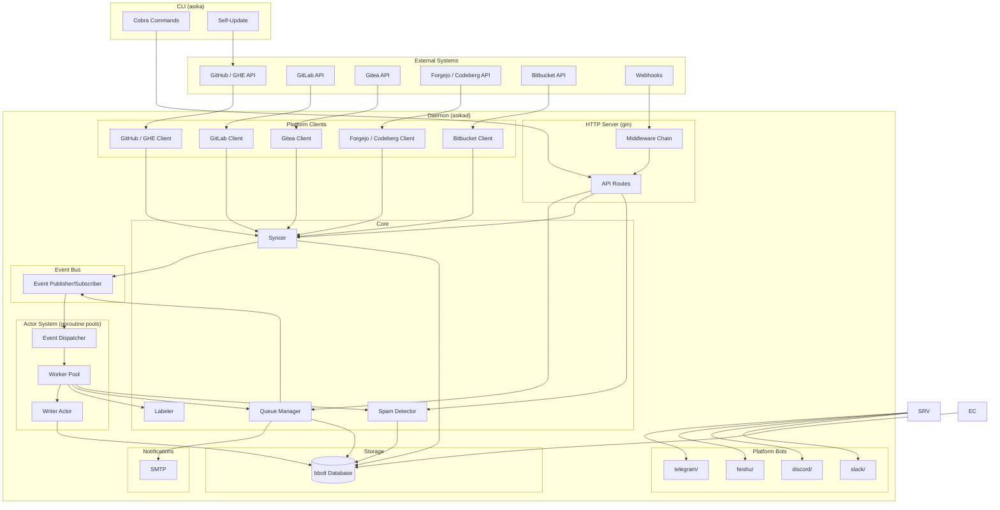
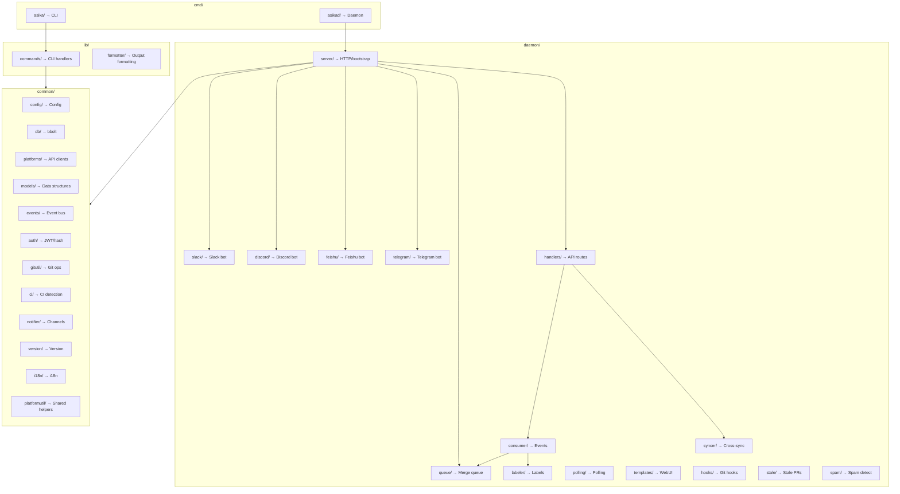

## Architecture



### Middleware Chain

Request processing order:

1. **initCheckMiddleware** — Redirects to `/wizard` if server not initialized
2. **LocaleMiddleware** — Detects language from cookie or Accept-Language header
3. **Logger** — Request logging via slog
4. **Recovery** — Panic recovery
5. **MetricsMiddleware** — Request counting and latency tracking
6. **CORS** — Cross-origin resource sharing
7. **RateLimit** — Per-IP token bucket (optional)
8. **AuthMiddleware** — JWT/cookie authentication

Route-specific middleware:

- `RequireRole(role)` — Checks role hierarchy (admin > operator > viewer)
- `RequireAnyRole(roles...)` — Checks if user has any of the listed roles
- `RequirePermission(field)` — Checks granular permission (can_approve, can_merge, can_close, can_reopen, can_spam, can_manage_queue)
- `RequireRepoGroupAccess()` — Checks user's allowed repo groups against URL parameter

### Permission Model

Three-tier role hierarchy with six granular permissions:

| Permission | viewer | operator | admin |
|------------|--------|----------|-------|
| View PRs | ✅ | ✅ | ✅ |
| Approve PRs | ❌ | Configurable | ✅ |
| Merge/Rebase | ❌ | Configurable | ✅ |
| Close PRs | ❌ | Configurable | ✅ |
| Reopen PRs | ❌ | Configurable | ✅ |
| Mark Spam | ❌ | Configurable | ✅ |
| Manage Queue | ❌ | Configurable | ✅ |
| User Management | ❌ | ❌ | ✅ |
| Config Management | ❌ | ❌ | ✅ |

Non-admin users can be assigned to specific repo groups. Empty `AllowedRepoGroups` = access to all groups (backward compatible).

### Background Workers

- **Queue Checker** — Every 30s, checks all queue items for merge readiness (approvals, CI, conflicts)
- **Spam Detector** — Scans for spam PRs based on author frequency and title keywords
- **Spam Auto-Clean** — Periodically clears spam keywords and resets author trigger (configurable interval)
- **Poller** — Fetches PRs from platforms at configured intervals (polling mode)
- **Event Consumer** — Dispatches events from the event bus to the worker pool
- **Stale Checker** — Periodically checks for and handles stale PRs
- **Webhook Retry Worker** — Retries failed webhook deliveries with exponential backoff

### Actor System (Goroutine Pools)

The event consumer uses an Actor-model architecture with goroutine pools for concurrent processing:

- **Event Dispatcher** — Single goroutine reads from the event bus and dispatches events to the worker pool
- **Worker Pool** — Fixed pool of 4 goroutines processing events concurrently (configurable via `workerPool.Size`)
- **Writer Actor** — Dedicated goroutine serializing all bbolt writes through a channel (buffer=256). Eliminates write contention since bbolt requires serialized transactions
- **Event Bus** — Blocking publish with backpressure (no silent event drops)

```
Publisher → [100 buffer] → Event Dispatcher → Worker Pool (4 goroutines)
                                                  ↓
                                            Writer Actor (bbolt)
```

This architecture provides:
- Parallel event processing (up to 4 events concurrently)
- Ordered, contention-free bbolt writes via single writer goroutine
- Backpressure instead of silent event drops
- Independent goroutine for slow operations (labeler API calls, syncer operations)

### Storage (bbolt)

Buckets:

| Bucket | Key Format | Value |
|--------|-----------|-------|
| `prs` | `{repoGroup}#{platform}#{prNumber}` | PRRecord (JSON) |
| `pr_index_by_id` | `{prID}` → bbolt index | → `prs` bucket key |
| `pr_index_by_rg_num` | `{repoGroup}#{prNumber}` → bbolt index | → `prs` bucket key |
| `queue_items` | `{repoGroup}#{prID}` | QueueItem (JSON) |
| `users` | `{username}` | User (JSON) |
| `logs` | `{timestamp}` | AuditLog (JSON) |
| `sync_history` | `{timestamp}` | SyncRecord (JSON) |
| `config_snapshots` | `{version}` | ConfigSnapshot (JSON) |
| `config` | `{key}` | Config value (JSON) |
| `backups` | `{filename}` | Backup metadata (JSON) |

Performance optimizations:
- Index-based PR lookups (O(1) vs O(n) scan)
- Prefix-based queue iteration (scan only relevant repo group)
- Single-pass stats computation (merged 5 scans into individual passes)

## Development

### Project Structure



### Running Tests

```bash
# All tests
bash build.sh test

# Or directly
go test ./common/... ./lib/... ./daemon/...

# Specific package
go test ./common/config/...

# Specific test
go test ./common/config -run TestLoad

# With verbose output
go test -v ./daemon/queue/...

# With race detector
go test -race ./...
```

### Build Commands

```bash
# Build both binaries
bash build.sh build

# Or manually
go build -o asika ./cmd/asika
go build -o asikad ./cmd/asikad

# With version info
go build -ldflags="-X 'asika/common/version.Version=v1.0.0'" -o asikad ./cmd/asikad

# Download dependencies
bash build.sh dep

# Clean build artifacts
bash build.sh clean

# Deep clean (includes Go cache)
bash build.sh distclean
```

### Code Conventions

- **Error handling**: All errors must be handled. Use `fmt.Errorf("context: %w", err)` for wrapping.
- **Logging**: Use `log/slog` for structured logging. No `fmt.Println` in server code.
- **i18n**: User-facing strings use `{{t "key"}}` in templates. Add translations to `common/i18n/locales/zh.json`.
- **Database**: Use `PutPRWithIndex` when storing PRs (maintains indices). Use `BucketForEachPrefix` for group-scoped queries.
- **Permissions**: Write handlers check `RequirePermission`. Bot handlers check permissions at the command level.
- **Platform bots**: Each bot lives in its own sub-package under `daemon/platform/`. Shared helpers (GetPRByID, Truncate, InactivityDays, HasLabelStr, ParseInt) are in `common/platformutil/`.
- **Testing**: New features should include tests. Use `testutil.NewTestDB()` for isolated DB tests.
