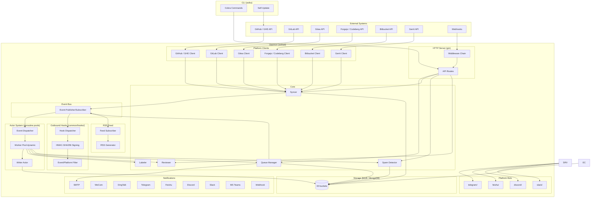
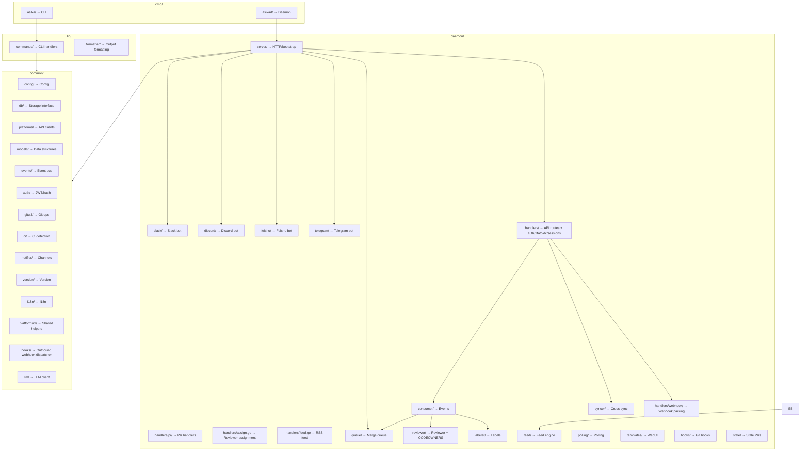

## Workflow Mode (CI/CD Integration)

**Location**: `daemon/workflow/`

Workflow mode runs Asika in CI/CD pipelines as a one-shot process (no daemon, no webhooks). It detects the platform, reads `asika_workflow_config.toml`, evaluates conditions against PR state, and executes label/merge/close operations.

### Components

- **detector.go**: Platform detection from CI environment variables (GitHub Actions, GitLab CI, Gitea Actions, Forgejo Actions, Bitbucket Pipelines, Gerrit CI). Returns `PlatformInfo` with platform type, PR number, repository, token, branches, and API base URL.
- **config.go**: Loads and validates `asika_workflow_config.toml` from repository root. Validates label actions (`add`/`remove`), merge methods (`merge`/`squash`/`rebase`), and required fields.
- **evaluator.go**: Evaluates boolean conditions (`ci_passed`, `ci_failed`, `approved`, `has_conflicts`, `draft`, `has_label("name")`) with operators (`&&`, `||`, `!`). Fetches PR context via platform client (CI status from commit SHA, approvals, conflicts, labels).
- **executor.go**: Executes operations via platform clients. Labels: add/remove based on conditions. Merge: auto-merge with configurable method and branch deletion. Close: with optional comment and label.
- **workflow.go**: Main orchestrator. Entry point: `Run(workDir)` called by `asikad --workflow`. Flow: detect platform → load config → init client → fetch PR context → execute labels → execute merge → execute close.

### Integration Points

- **Platform clients**: Reuses `common/platforms/` implementations (GitHub, GitLab, Gitea, Bitbucket, Gerrit).
- **Entry point**: `cmd/asikad/main.go` handles `--workflow` flag, calls `workflow.Run()`, exits after execution.
- **Config file**: Repository-specific `asika_workflow_config.toml` (not global `asika.toml`).

### Supported Platforms

| Platform | Detection Variable | Token Variable | API URL Variable |
|----------|-------------------|----------------|------------------|
| GitHub Actions | `GITHUB_ACTIONS` | `GITHUB_TOKEN` | `GITHUB_API_URL` |
| GitLab CI | `GITLAB_CI` | `CI_JOB_TOKEN` | `CI_API_V4_URL` |
| Gitea Actions | `GITEA_ACTIONS` | `GITEA_TOKEN` | `GITEA_API_URL` |
| Forgejo Actions | `FORGEJO_ACTIONS` | `FORGEJO_TOKEN` | `FORGEJO_API_URL` |
| Bitbucket Pipelines | `BITBUCKET_PIPELINE_UUID` | `ASIKA_TOKEN` or `BITBUCKET_ACCESS_TOKEN` | (hardcoded) |
| Gerrit CI | `GERRIT_CHANGE_NUMBER` | `ASIKA_TOKEN` or `GERRIT_HTTP_PASSWORD` | `GERRIT_HOST` |

**Note**: Bitbucket and Gerrit require `ASIKA_TOKEN` environment variable (CI job secret) since they lack built-in token variables.

### Condition Syntax

- **Variables**: `ci_passed`, `ci_failed`, `has_conflicts`, `approved`, `draft`
- **Functions**: `has_label("label-name")`
- **Operators**: `&&` (AND), `||` (OR), `!` (NOT)
- **Examples**: `ci_passed && approved`, `!draft && !has_conflicts`, `has_label("urgent") || has_label("hotfix")`

### Example Config

```toml
[workflow]
enabled = true

[[workflow.labels]]
condition = "ci_passed"
action = "add"
label = "ready-to-merge"

[workflow.merge]
enabled = true
condition = "ci_passed && approved && !has_conflicts"
auto_merge = true
merge_method = "squash"
delete_branch = true

[workflow.close]
enabled = false
condition = "ci_failed"
comment = "Auto-closed due to CI failure"
add_label = "auto-closed"
```

## Architecture


```mermaid
graph TB
    subgraph External["External Systems"]
        GH[GitHub / GHE API]
        GL[GitLab API]
        GT[Gitea API]
        FJ[Forgejo / Codeberg API]
        BB[Bitbucket API]
        GR[Gerrit API]
        WH[Webhooks]
    end

    subgraph CLI["CLI (asika)"]
        CM[Cobra Commands]
        SU[Self-Update]
    end

    subgraph Daemon["Daemon (asikad)"]
        subgraph HTTP["HTTP Server (gin)"]
            MW[Middleware Chain]
            RO[API Routes]
        end

        subgraph Core["Core"]
            QC[Queue Manager]
            SY[Syncer]
            LB[Labeler]
            RV[Reviewer]
            SD[Spam Detector]
        end

        subgraph Platforms["Platform Clients"]
            PC_GH[GitHub / GHE Client]
            PC_GL[GitLab Client]
            PC_GT[Gitea Client]
            PC_FJ[Forgejo / Codeberg Client]
            PC_BB[Bitbucket Client]
            PC_GR[Gerrit Client]
        end

        subgraph Events["Event Bus"]
            EB[Event Publisher/Subscriber]
        end

        subgraph Hooks["Outbound Hooks (common/hooks/)"]
            HOOK_DISP[Hook Dispatcher]
            HOOK_SIG[HMAC-SHA256 Signing]
            HOOK_FILT[Event/Platform Filter]
        end

        subgraph Actors["Actor System (goroutine pools)"]
            DP[Event Dispatcher]
            WP[Worker Pool dynamic]
            WA[Writer Actor]
        end

        subgraph Notify["Notifications"]
            SMTP[SMTP]
            WCN[WeCom]
            DT[DingTalk]
            TG_N[Telegram]
            FS_N[Feishu]
            DC_N[Discord]
            SL_N[Slack]
            MST[MS Teams]
            WH_N[Webhook]
        end

        subgraph Bots["Platform Bots"]
            TG[telegram/]
            FS[feishu/]
            DC[discord/]
            SL[slack/]
        end

        subgraph Feed["RSS Feed"]
            FD[Feed Subscriber]
            FG[RSS Generator]
        end

        subgraph DB["Storage (bbolt / MongoDB)"]
            BDB[(33 buckets)]
        end
    end

    GH --> PC_GH
    GL --> PC_GL
    GT --> PC_GT
    FJ --> PC_FJ
    BB --> PC_BB
    GR --> PC_GR
    WH --> MW

    CM --> RO
    SU --> GH

    MW --> RO
    RO --> QC
    RO --> SY
    RO --> SD
    RO --> RV

    QC --> EB
    SY --> EB
    EB --> DP
    DP --> WP
    WP --> WA
    WA --> BDB
    WP --> LB
    WP --> RV
    WP --> QC
    WP --> SD

    PC_GH --> SY
    PC_GL --> SY
    PC_GT --> SY
    PC_FJ --> SY
    PC_BB --> SY
    PC_GR --> SY

     QC --> SMTP
     SRV --> TG
     SRV --> FS
     SRV --> DC
     SRV --> SL

    SY --> BDB
    QC --> BDB
    EC --> BDB
    SD --> BDB

    EB --> HOOK_DISP
    HOOK_DISP --> HOOK_SIG
    HOOK_SIG --> HOOK_FILT

    EB --> FD
    FD --> FG
```

### Middleware Chain

Request processing order:

1. **initCheckMiddleware** — Redirects to `/wizard` if server not initialized
2. **LocaleMiddleware** — Detects language from cookie or Accept-Language header
3. **Logger** — Request logging via slog
4. **Recovery** — Panic recovery
5. **MetricsMiddleware** — Request counting and latency tracking
6. **CORS** — Cross-origin resource sharing
7. **RateLimit** — Per-IP token bucket (optional)
8. **AuthMiddleware** — JWT/cookie authentication + session validity check (verifies session exists in DB; rejects revoked sessions)
9. **FingerprintMiddleware** — Optional HMAC fingerprint verification (when `auth.fingerprint_enabled`)

Route-specific middleware:

- `RequireRole(role)` — Checks role hierarchy (admin > operator > viewer)
- `RequireAnyRole(roles...)` — Checks if user has any of the listed roles
- `RequirePermission(field)` — Checks granular permission (can_approve, can_merge, can_close, can_reopen, can_spam, can_manage_queue, can_revert, can_comment, can_label)
- `RequireRepoGroupAccess()` — Checks user's allowed repo groups against URL parameter; also supports API key `AllowedRepoGroups`
- `RequireRepoAccess()` — Finer-grained check: resolves the actual `owner/repo` from the PR record and checks against user's `AllowedRepos` list
- `RequireSpaceAccess()` — Checks if the user is a member of the team space that owns the requested repo group; resolves space ownership via `TeamSpace.RepoGroups`. DB errors return 500 (fail-closed).
- `RequireSelfOrAdmin()` — Ensures the current user matches the `:username` path param or is admin. Used on notification prefs and similar user-scoped routes.

### Permission Model

Three-tier role hierarchy with six granular permissions:

| Permission | viewer | operator | admin |
|------------|--------|----------|-------|
| View PRs | ✅ | ✅ | ✅ |
| Approve PRs | ❌ | Configurable | ✅ |
| Merge/Rebase | ❌ | Configurable | ✅ |
| Close PRs | ❌ | Configurable | ✅ |
| Reopen PRs | ❌ | Configurable | ✅ |
| Mark Spam | ❌ | Configurable | ✅ |
| Manage Queue | ❌ | Configurable | ✅ |
| Revert PRs | ❌ | Configurable | ✅ |
| Comment PRs | ❌ | Configurable | ✅ |
| Label PRs | ❌ | Configurable | ✅ |
| User Management | ❌ | ❌ | ✅ |
| Config Management | ❌ | ❌ | ✅ |
| Account Management | — | Self only | All users |

Non-admin users can be assigned to specific repo groups and repos:
- `AllowedRepoGroups []string` — empty = access to all groups (backward compatible)
- `AllowedRepos []string` — empty = access to all repos; format: `"owner/repo"`; resolved from PR record at request time

Both fields are supported on `User` (JWT auth) and `APIKey` (API key auth).

Temporary tokens: Users can generate short-lived JWT tokens (1m–24h) with a `temp: true` claim and a `permissions` map. `RequirePermission` middleware checks temp token permissions before falling through to DB permissions. Generated via `POST /api/v1/auth/temp-token`.

### Fingerprint Authentication

Fingerprint tokens provide a lightweight HMAC-based device identity mechanism, supplementing JWT auth:

- **Config**: `[auth]` section: `fingerprint_enabled`, `fingerprint_secret`, `fingerprint_expiry` (default 168h/7d)
- **Token format**: `id:HMAC-SHA256(secret, username:id:expiry)` — stateless verification
- **Storage**: In-memory map with `sync.RWMutex`; cleaned up hourly by background worker
- **Middleware**: `FingerprintMiddleware` extracts token from `X-Fingerprint-Token` header or `Authorization: Fingerprint <token>`. Optional — skips if no token present.
- **Endpoints** (all require JWT auth):
  - `POST /api/v1/auth/fingerprints` — Register a new fingerprint token
  - `POST /api/v1/auth/fingerprints/verify` — Verify a fingerprint token
  - `GET /api/v1/auth/fingerprints` — List active fingerprint IDs for current user
  - `DELETE /api/v1/auth/fingerprints/:id` — Revoke a specific fingerprint
  - `DELETE /api/v1/auth/fingerprints` — Revoke all fingerprints for current user
- **Context**: On successful verification, sets `fingerprint_user` and `fingerprint_verified` in gin context
- **Init**: `auth.InitFingerprint(secret, expiry)` called during bootstrap when enabled

### Two-Factor Authentication (TOTP)

TOTP-based 2FA (RFC 6238) using HMAC-SHA1, compatible with Google Authenticator / Authy:

- **Config**: `[auth]` section: `totp_required` (bool, default false) — when true, all users must complete 2FA to log in
- **User fields**: `Email` (string), `TOTPSecret` (base32-encoded), `TOTPEnabled` (bool), `BackupCodes` (bcrypt-hashed, 10 codes)
- **Endpoints** (all require JWT auth):
  - `GET /api/v1/auth/2fa` — Check 2FA status for current user
  - `POST /api/v1/auth/2fa/enroll` — Generate TOTP secret, return QR code URL
  - `POST /api/v1/auth/2fa/verify` — Verify TOTP code and enable 2FA (returns backup codes)
  - `POST /api/v1/auth/2fa/disable` — Disable 2FA (requires current password)
  - `POST /api/v1/auth/2fa/codes` — Regenerate backup codes (requires current password)
- **Login flow**: When 2FA is enabled/required, password verification returns `{"two_factor_required": true, "session_id": "..."}`. Client submits TOTP code + session_id to complete login.
- **Backup codes**: 10 single-use codes generated on enable/regenerate. Stored as bcrypt hashes. Plain codes shown once to user.
- **Implementation**: Pure standard library (HMAC-SHA1 + base32), no external TOTP dependency

### Password Recovery

Email-based password reset flow using the existing SMTP notifier configuration:

- **User field**: `Email` (string) — set during wizard initialization (admin), via admin user management (`PUT /api/v1/users/:username`), or self-service in account settings
- **Endpoints** (unauthenticated):
  - `POST /api/v1/auth/forgot-password` — Accepts `{username}`. If user exists and has email, generates a reset token and sends a reset link via SMTP. Always returns the same success message (prevents user enumeration).
  - `POST /api/v1/auth/reset-password` — Accepts `{token, new_password}`. Validates token (15-min TTL, single-use), updates password (bcrypt), revokes all user sessions.
- **Token storage**: `password_reset_tokens` bucket, keyed by `SHA256(token)`. Value: `{username, expiresAt}`. Tokens are deleted on use or expiry.
- **SMTP**: Reuses the first configured `[[notify]] type=smtp` notifier. Returns 503 if no SMTP notifier is configured.
- **Page**: `GET /reset-password?token=xxx` serves the reset password page.

### Session Management

JWT-based session tracking with database-backed revocation:

- **Config**: `[auth]` section: `session_inactivity_timeout` (default `720h`/30d), `session_cleanup_interval` (default `1h`)
- **JWT claims**: `jti` (JWT ID, UUID), `sid` (Session ID) — added via `GenerateJWTWithSession()`
- **Session record**: `id`, `username`, `token_prefix`, `issued_at`, `last_used_at`, `expires_at`, `ip_address`, `user_agent`
- **Storage**: `sessions` bucket (key: sessionID) + `sessions_by_user` index (key: `username:sessionID`)
- **Middleware**: `AuthMiddleware` validates session existence in DB after JWT validation. Revoked sessions are rejected with 401.
- **Endpoints** (all require JWT auth):
  - `GET /api/v1/auth/sessions` — List current user's active sessions
  - `DELETE /api/v1/auth/sessions/:id` — Revoke a specific session
  - `DELETE /api/v1/auth/sessions` — Revoke all other sessions (keeps current)
- **Login/Logout**: Login creates a session record; Logout deletes it
- **Cleanup worker**: Periodically removes sessions inactive longer than `session_inactivity_timeout`
- **WebUI**: `/account` page shows active sessions with revoke buttons

### LDAP/Active Directory Authentication

LDAP authentication provides an alternative auth backend against corporate directory servers:

- **Config**: `[ldap]` section: `enabled`, `host`, `port`, `use_tls`, `start_tls`, `bind_dn`, `bind_password`, `base_dn`, `user_filter`, `group_filter`, `group_dn`, `allowed_groups`, `auto_create`, `default_role`, `email_attribute`, `name_attribute`
- **Module**: `common/auth/ldap.go` — `LDAPAuthenticator` with `Authenticate(username, password)` returning `*LDAPUserInfo`
- **Login flow**: When local user not found in DB, falls back to LDAP. On success, optionally auto-creates local user with `default_role`
- **Group filtering**: When `allowed_groups` is configured, verifies user membership before allowing login
- **Dependency**: `github.com/go-ldap/ldap/v3`

### OIDC/SSO Authentication

OAuth2 Authorization Code Flow for external identity providers:

- **Config**: `[[auth.oidc_providers]]` array with fields: `name`, `display_name`, `client_id`, `client_secret`, `issuer_url`, `scopes`, `auth_url`, `token_url`, `user_info_url`, `auto_create`, `default_role`
- **Endpoints** (public):
  - `GET /api/v1/auth/oidc/login/:provider` — Redirect to provider's auth URL
  - `GET /api/v1/auth/oidc/callback/:provider` — Handle OAuth2 callback, create/link user, issue JWT
- **Endpoints** (require JWT auth):
  - `GET /api/v1/auth/oidc/links` — List current user's linked OIDC accounts
  - `POST /api/v1/auth/oidc/link` — Link an OIDC identity to current user
  - `DELETE /api/v1/auth/oidc/link?provider=&subject=` — Unlink an OIDC identity
- **Auto-create**: When `auto_create = true`, first-time OIDC login automatically creates an asika user with `default_role` (default `operator`)
- **Link mapping**: `oidc_links` bucket maps `provider:subject` → `username`
- **2FA integration**: OIDC-authenticated users with 2FA enabled still require TOTP verification

### Background Workers

- **Queue Checker** — Every 30s, checks all queue items for merge readiness (approvals, CI, conflicts). Items with a future `ScheduleAt` time are skipped until the scheduled time arrives.
- **Spam Detector** — Scans for spam PRs based on author frequency and title keywords
- **Spam Auto-Clean** — Periodically clears spam keywords and resets author trigger (configurable interval)
- **Poller** — Fetches PRs from platforms at configured intervals (polling mode)
- **Event Consumer** — Dispatches events from the event bus to the worker pool
- **Stale Checker** — Periodically checks for and handles stale PRs
- **Webhook Retry Worker** — Retries failed webhook deliveries with exponential backoff. Deduplicates webhooks using delivery ID (`webhook_dedup` bucket) to prevent duplicate processing.
- **Webhook Handler** — Enforces 1MB max request body size via `http.MaxBytesReader`. Extracts platform-specific delivery ID headers (`X-GitHub-Delivery`, `X-Gitlab-Event-ID`, `X-Gitea-Delivery`, `X-Request-UUID`, `X-Gerrit-Event-ID`) for idempotency dedup check against `webhook_dedup` bucket.
- **Webhook Health Checker** — Every 2 minutes, checks `webhook_health` bucket per repo group/platform. If no webhook received within threshold, enables forced polling for that repo group (auto-fallback).
- **Serial Validation Worker** — Processes `serial_queue` bucket items through validation state machine: rebase onto latest main → re-validate CI → mark merge-ready. Prevents post-merge CI failures.
- **Escalation Worker** — Hourly scans open PRs, calculates priority from labels + file paths, sends tiered notifications: reviewer → team → tech_lead based on priority and time open.
- **Feed Subscriber** — Subscribes to the event bus, feeds PR events (opened/merged/closed/approved/reopened) into the in-memory ring buffer for RSS generation.
- **Cross-Platform Syncer** — On PR merge, syncs the merge commit to all configured target platforms (GitHub/GitLab/Gitea/Forgejo/Codeberg/Bitbucket/Gerrit). Uses cherry-pick strategy with retry (3 attempts, exponential backoff). Publishes `sync_completed`/`sync_failed` events. Sync failure triggers notifier alert.
- **Auto-Rebase Worker** — Periodically checks for open PRs with conflicts and rebases them automatically. Configurable via `[auto_rebase]` section: `enabled`, `exclude_labels`, `exclude_authors`.
- **Session Cleanup Worker** — Periodically removes sessions inactive longer than `session_inactivity_timeout`. Configurable via `[auth]` section. Logs count of removed sessions.
- **Auto-Merge Scanner** — Every 5 minutes, scans open PRs against configured auto-merge rules (label-based conditions with required approvals and CI checks). Event-driven trigger on `pr_approved`.

### Reviewer Auto-Assignment

The reviewer system assigns reviewers to PRs automatically through two mechanisms:

1. **Review Rules** — Pattern-based rules (file path, title, author) defined globally (`[review_rules]`) or per-repo-group (`[[repo_groups.review_rules]]`). Group rules are merged with global rules, sorted by priority. Reuses the labeler's `MatchRule()` engine with `file:`, `title:`, `author:` scope prefixes.

2. **CODEOWNERS** — When no review rules match, the system fetches a CODEOWNERS file from the repository (tries `CODEOWNERS`, `.github/CODEOWNERS`, `.gitlab/CODEOWNERS`, `docs/CODEOWNERS`). Parsed with GitHub-style last-match-wins semantics. Results are cached in-memory with a 5-minute TTL.

Trigger flow: webhook/poller → event bus → consumer → `reviewer.HandlePROpenedWithCodeOwners()` → platform API `RequestReview()`.

Manual assignment endpoints:
- `POST /api/v1/repos/:repo_group/prs/:pr_id/assign` — Manually assign reviewers (requires `approve` permission)
- `POST /api/v1/repos/:repo_group/prs/:pr_id/codeowners-assign` — Re-evaluate CODEOWNERS and assign (requires `approve` permission)

### Notification Preferences

Per-user notification preferences are stored in `notification_prefs` bucket (key: `{username}`). Each user can configure:

- `Enabled` — Master switch for all notifications
- `EnabledNotifiers` — Which notifier types to use (e.g. `["smtp", "telegram"]`)
- `EventPrefs` — Per-event-type enable/disable map (e.g. `{"pr_opened": true, "pr_closed": false}`)
- `DigestMode` — `"realtime"`, `"hourly"`, or `"daily"`
- `QuietHoursOverride` — Per-user quiet hours that override the global config
- `LabelSubs` — Subscribed PR labels (e.g. `["bug", "area/*"]`). Empty/nil = subscribe to all labels (backward compatible). Supports glob patterns via `path.Match` (e.g. `"area/*"` matches `"area/frontend"`).

The `sendNotificationInternal` function checks two filters before sending:
1. `isNotifierEnabledForAnyUser()` — checks `Enabled`, `EnabledNotifiers`, and `EventPrefs`
2. `isLabelSubscribedForAnyUser()` — checks `LabelSubs` against the PR's labels. When `prLabels` is nil (not provided), the check is skipped. When no users have `LabelSubs` configured, all notifications pass through (backward compatible).

Label subscription notifications are triggered by the consumer's `handlePRLabeled` handler via `handlers.NotifyLabelSubscribers`, which calls the core notifier's `SendNotificationWithLabels` with the PR's labels. The labeler also publishes `pr_labeled` events after auto-labeling to ensure label subscriptions work for auto-applied labels.

Management endpoints:
- `GET/PUT /api/v1/users/:username/notifications` — Get/update preferences (requires self or admin)
- `GET /notifications` — WebUI preference management page

### RSS Feed

The RSS feed provides a pull-based stream of PR activity:

- `GET /api/v1/feed.xml` — Global RSS feed (all repo groups). Append `?repo_group=<name>` to filter.
- `GET /api/v1/feed/config` — View feed configuration (admin only)
- `PUT /api/v1/feed/config` — Update feed configuration (admin only)

Feed configuration (`[feed]` TOML section):
```toml
[feed]
enabled     = true
title       = "Asika PR Feed"
max_items   = 50
public_feed = false
```

Feed items are stored in an in-memory ring buffer (default 50 items max). The feed subscriber consumes events from the event bus: `pr_opened`, `pr_merged`, `pr_closed`, `pr_approved`, `pr_reopened`.

### Cross-Platform Syncer

`daemon/syncer/` handles cross-platform code synchronization:

- **Sync trigger**: On PR merge event, `SyncOnMerge` cherry-picks the merge commit to all configured target platforms
- **Default branch sync**: Always syncs the default branch merge commit via cherry-pick + force push
- **All branch sync**: When `branch_sync = "all"` is configured in `[[repo_groups]]`, enumerates all branches via `git for-each-ref` and force pushes each to all targets. Runs after default branch sync.
- **Tag sync**: When `sync_tags = true` is configured, enumerates all tags via `git for-each-ref` and force pushes each to all targets. Tags are immutable — no conflict resolution needed.
- **Bare repo cache**: When `[git] repo_clone_path` is set, uses persistent bare repositories (`git clone --bare`) instead of temp dirs. Bare repos are cloned once and updated with `git fetch` per sync, dramatically reducing sync time.
- **Force push**: All push operations use `Force: true` — cross-platform sync is a deterministic overwrite, the goal is to make all platforms match the source
- **Target platforms**: All 7 platforms (GitHub, GitLab, Gitea, Forgejo, Codeberg, Bitbucket, Gerrit) — excludes source platform, skips empty repo configs
- **Cherry-pick retry**: `cherryPickWithRetry` retries up to 3 times with exponential backoff on conflict errors. Re-fetches source before each retry. Falls back to `CherryPickMergeDiff` (applies only parent1→merge diff) if standard hard-reset cherry-pick fails.
- **Push retry**: `pushWithRetry` retries up to 3 times with exponential backoff on transient errors only (network issues, rate limits)
- **Event publishing**: Publishes `EventSyncFailed` on partial/complete failure, `EventSyncCompleted` on full success
- **Failure notification**: Wired to notifier system via `SetNotifyFunc`. Sends alert with PR title, source/target platforms, and failure reason
- **Branch deletion sync**: `SyncBranchDeletion` syncs branch deletes to all targets with retry on transient errors
- **Concurrency**: Per-repo-group mutex prevents concurrent syncs for the same group
- **Sync history**: All sync attempts recorded in `sync_history` bucket with status (success/failed) and error messages
- **PR state sync**: When `sync_pr_state = true` is configured in `[[repo_groups]]`, `syncPRState` automatically merges/closes the corresponding PR on target platforms after successful git sync (matched by head+base branch, with head SHA fallback). Pre-sync `preSyncConflictCheck` checks for open PRs with the same head branch (dabao1955 scenario). `conflict_check` config: `"warn"` (default) = notify only, `"blocking"` = abort sync and alert. Post-sync `verifyPRState` polls target to confirm PR closure (5 retries, exponential backoff).
- **Bug fix**: `GetRepoGroupByName` and `GetRepoGroups` now correctly map the `Gerrit` field (previously silently dropped)

### Actor System (Goroutine Pools)

The event consumer uses an Actor-model architecture with goroutine pools for concurrent processing:

- **Event Dispatcher** — Single goroutine reads from the event bus and dispatches events to the worker pool
- **Worker Pool** — Dynamic pool of goroutines processing events concurrently. Scales between `min_workers` (default 2) and `max_workers` (default 8) based on channel utilization. Scale up when >= `scale_up_pct` (default 75%), scale down when <= `scale_down_pct` (default 25%), with cooldown (default 30s) to prevent thrashing. Configurable via `[worker_pool]` TOML section, hot-reloadable at runtime.
- **Writer Actor** — Dedicated goroutine serializing all bbolt writes through a channel (buffer=256). Eliminates write contention since bbolt requires serialized transactions
- **Event Bus** — Non-blocking publish; slow subscribers are skipped (dropped events are logged with warn)
- **Pool Metrics** — Tracks worker count, total/active tasks, utilization%, scale up/down event counts, goroutine count. Exposed via `poolMetrics.snapshot()`.

```
Publisher → [100 buffer] → Event Dispatcher → Worker Pool (min..max goroutines, dynamic)
                                               ↓
                                         Writer Actor (bbolt)
```

This architecture provides:
- Adaptive parallel event processing (scales with load)
- Ordered, contention-free bbolt writes via single writer goroutine
- Backpressure instead of silent event drops
- Independent goroutine for slow operations (labeler API calls, syncer operations)
- Runtime config updates via `PUT /api/v1/config` and SIGHUP signal

### CPU Thread Control

`[server]` section supports `min_procs` and `max_procs` to control `runtime.GOMAXPROCS`:

- `min_procs` — floor for OS threads; 0 = Go default (1)
- `max_procs` — ceiling for OS threads; 0 = use all CPUs (NumCPU)
- Validation: when both are non-zero, `max_procs >= min_procs`
- Effective value: `max(max_procs, min_procs)` (or NumCPU if both are 0)
- Applied at startup in `Bootstrap()` and hot-reloadable via `PUT /api/v1/config`
- Configurable through WebUI settings page, all platform bots display current values

### Storage

The project supports two database backends via a pluggable `Storage` interface (`common/db/db.go`):

| Engine | Package | Notes |
|--------|---------|-------|
| **bbolt** (default) | `go.etcd.io/bbolt` | Embedded KV store; single-file, serializes all writes via `db.Update` |
| **MongoDB** | `go.mongodb.org/mongo-driver/v2` | Document store; connected via URI + database name |

The active backend is selected at startup via `models.DatabaseConfig.Type` (`"bbolt"` or `"mongo"`). Cross-engine migration is available via `MigrateBboltToMongo()` / `MigrateMongoToBbolt()`.

Buckets (37 total, defined in `common/db/buckets.go`). Note: `notification_dedup` bucket is also used for digest buffering (key format: `{prID}:{notifierType}` for buffer entries, `{eventType}:{prID}:{notifierType}` for sent-event tracking). `sync_history` bucket is also used for deployment records (key: deployment ID):

| Bucket | Key Format | Value |
|--------|-----------|-------|
| `prs` | `{repoGroup}#{prID}` | PRRecord (JSON) |
| `pr_index_by_id` | `{repoGroup}:{prID}` → index | → `prs` bucket key |
| `pr_index_by_rg_num` | `{repoGroup}:{prNumber}` → index | → `prs` bucket key |
| `queue_items` | `{repoGroup}#{prID}` | QueueItem (JSON); includes `RetryCount`, `NextRetryAt` for backoff |
| `serial_queue` | `{repoGroup}#{prID}` | QueueItem (JSON); serial validation queue with `ValidationStatus` field |
| `users` | `{username}` | User (JSON) |
| `api_keys` | `{keyID}` | APIKey (JSON) |
| `logs` | `{nanosecondTimestamp}_{randomHex}` | AuditLog (JSON); includes `Before`/`After` diff fields for state-changing operations (approve, close, reopen, mark_spam) |
| `audit_log_index` | `actor:{actor}:{logKey}`, `repo_group:{rg}:{logKey}`, `action:{action}:{logKey}`, `category:{cat}:{logKey}`, `pr:{rg}:{prNumber}:{logKey}` | Secondary index (JSON); enables efficient audit log filtering by actor, repo group, action, category, and PR number |
| `sync_history` | `{syncRecordID}` | SyncRecord (JSON) |
| `config` | `{key}` | Config value (JSON); also stores `__migration_version__`, `__config_version__`, label rules |
| `config_history` | `{zeroPadded6DigitVersion}` | ConfigSnapshot (JSON); max 20 snapshots, rollback-capable; stores `{config, created_at}` wrapper |
| `webhook_retries` | `{retryID}` | WebhookRetry (JSON) |
| `webhook_dedup` | `{deliveryID}` | Processed timestamp (RFC3339); prevents duplicate webhook processing |
| `repos` | — | Repository records (used only during cross-engine migration) |
| `spam_authors` | `{author}:{platform}` | SpamAuthor (JSON); tracks spam PR authors with count and timestamps |
| `webhook_health` | `{repoGroup}:{platform}` | Last successful webhook timestamp (RFC3339) |
| `report_history` | `{nanosecondTimestamp}` | ReportHistoryEntry (JSON); generated report content with timestamp and period |
| `notification_prefs` | `{username}` | NotificationPreferences (JSON); per-user notification settings |
| `notification_dedup` | `{eventType}:{prID}:{notifierType}` | Dedup timestamp (RFC3339); 5-min TTL |
| `team_spaces` | `{spaceName}` | TeamSpace (JSON); team space with members and repo groups |
| `space_members` | `{spaceName}:{username}` | SpaceMember (JSON); space membership with role |
| `space_settings` | `{spaceName}:{key}` | Setting value (JSON); per-space config overrides |
| `issue_pr_links` | `{issueID}:{prID}` | IssuePRLink (JSON); bidirectional issue-to-PR links parsed from PR descriptions |
| `pr_dependencies` | `{prID}:{dependsOnPRID}` | PRDependency (JSON); cross-repo PR dependencies from `Depends-on:` declarations |
| `pr_templates` | `{repoGroup}:{platform}` | PRTemplate (JSON); fetched PR templates with checklist detection |
| `cross_space_deps` | `{sourcePRID}:{targetPRID}` | CrossSpaceDep (JSON); cross-space dependency records |
| `escalation_rules` | `{prID}` or `"default"` | Escalation state (JSON); last escalation timestamp or level |
| `pr_stacks` | `{stackID}` | PRStack (JSON); cross-platform PR chain tracking |
| `notification_digest` | `{username}:{notifier}:{nanotime}` | DigestEntry (JSON); buffered notifications for digest mode |
| `sessions` | `{sessionID}` | Session (JSON); active user sessions with IP, user agent, timestamps |
| `sessions_by_user` | `{username}:{sessionID}` → index | → `sessions` bucket key; enables per-user session listing |
| `oidc_links` | `{provider}:{subject}` | OIDCLink (JSON); maps OIDC provider+subject to asika username |
| `password_reset_tokens` | `{SHA256(token)}` | PasswordResetToken (JSON); username + expiresAt; 15-min TTL, single-use |

Performance optimizations:
- Index-based PR lookups via `PutPRWithIndex` / `GetPRByIndex` (O(1) vs O(n) scan)
- Two secondary index buckets: by PR UUID and by repo_group+PR number
- Prefix-based queue iteration (scan only relevant repo group)
- Single-writer actor (`consumer/writer.go`) serializes all bbolt writes through a buffered channel (buffer=256), eliminating write contention
- MongoDB native indexes: unique on `prs.id`, unique compound on `(repo_group, pr_number)`, unique on `users.username`, unique on `api_keys.id`, non-unique on `webhook_retries.next_retry`, unique on `webhook_dedup._id`

Schema migrations (bbolt only):
- Tracked via `__migration_version__` key in `BucketConfig`
- Version 1: initializes migration tracking
- Version 2: ensures `SpamFlag` defaults to `true` for PRs with `State == "spam"`
- Three startup data migrations: repo group re-keying, PR state fixes, live state sync from platform APIs

Config versioning:
- Snapshots stored in `config_history` with auto-incrementing zero-padded versions
- Auto-pruned to latest 20; rollback via `POST /api/v1/config/rollback`
- Auto-rollback: after `PUT /api/v1/config`, a 60s health-check timer verifies DB connectivity and notifier health; if either fails, automatically rolls back to the previous config snapshot

### Platform Clients

All platform implementations live in `common/platforms/` and satisfy `PlatformClient` interface (`common/platforms/interface.go`):

| Platform | File | SDK / Notes |
|----------|------|-------------|
| GitHub | `github.go` | `google/go-github` |
| GitLab | `gitlab.go` | `gitlab.com/gitlab-org/api/client-go` |
| Gitea | `gitea.go` | `code.gitea.io/sdk/gitea` |
| Forgejo/Codeberg | `gitea.go` | Reuses Gitea client |
| Bitbucket | `bitbucket.go` | **Pure HTTP, no SDK** |
| Gerrit | `gerrit.go` | `andygrunwald/go-gerrit` — uses `context.Context` on all calls |

PlatformClient interface methods:
- PR operations: `GetPR`, `ListPRs`, `ApprovePR`, `MergePR`, `ClosePR`, `ReopenPR`, `CommentPR`, `AddLabel`, `RemoveLabel`, `CreateLabel`
- Branch operations: `GetBranch`, `ListBranches`, `DeleteBranch`, `GetDefaultBranch`
- CI/merge: `GetCIStatus`, `GetDefaultMergeMethod`, `HasMultipleMergeMethods`, `GetApprovals`
- Diff/commits: `GetPRCommits`, `GetDiffFiles`, `GetPRDiff`, `CommentPRLine`
- Security: `HasSecurityAlerts` — returns repo-level security alerts (GitHub: Dependabot + SecretScanning + CodeScanning; GitLab: ProjectVulnerabilities; other platforms: nil stub)
- Comments: `ListPRComments` — returns PR comments with bot/user distinction (GitHub/GitLab: real; Gitea/Bitbucket/Gerrit: nil stub)
- Other: `GetPRBranchInfo`, `RequestReview`, `RevertPR`, `GetPRBody`, `GetFileContent`, `VerifyWebhookSignature`

### Webhook Package

`daemon/handlers/webhook/` is a sub-package:
- `webhook.go` — Core handler, `ProcessWebhook`, signature verify, event dispatch
- `github.go`, `gitlab.go`, `gitea.go`, `bitbucket.go`, `gerrit.go` — Per-platform parsing
- `comment.go` — `extractCommentPayload`
- `health.go` — `GET /api/v1/webhooks/health` returns per-platform health status
- `retry.go` — `StartWebhookRetryWorker`, exponential backoff, permanent failure notification

### Outbound Hooks

`common/hooks/` is a package for sending outbound webhook notifications when events occur:

- `hooks.go` — `HookDispatcher` subscribes to the event bus, filters by event type/repo group/platform, and fires HTTP POST requests to configured endpoints
- Signing: HMAC-SHA256 hex digest sent via `X-Signature-256` header
- Filtering: per-hook `HookFilterConfig` supports `repo_groups` and `platforms` allowlists
- Retry: per-hook `HookRetryConfig` with `max_attempts` and `backoff` duration string
- Config: hooks are defined in the top-level `[[hooks]]` array in the config TOML
- Bootstrap: `BootstrapHooks()` initializes the dispatcher during server startup; `InitHooksConfig()` is called on config load and hot-reload
- Shutdown: `HookDispatcher.Stop()` cancels the worker goroutine

### Security Scan

Merge queue security alert integration:

- **Config**: `[merge_queue.security_scan]` with `enabled`, `block_on_alerts`, `override_roles`, `override_permissions`, `cache_ttl_seconds`
- **Platform API**: `HasSecurityAlerts(ctx, owner, repo, number int)` returns `[]SecurityAlert`
  - GitHub: aggregates Dependabot, SecretScanning, and CodeScanning alerts (cursor-based pagination)
  - GitLab: uses `ProjectVulnerabilitiesService.ListProjectVulnerabilities`
  - Gitea/Bitbucket/Gerrit: return nil (stubs)
- **Merge gate**: `checkSecurity()` in the queue checker runs before `IsReadyToMerge()` and `ShouldMerge()`; sets `SecurityBlocked` status on the queue item
- **Override**: Admin/operator can set `security_override` on a queue item via the API to bypass the security block

### AI Summary

LLM-powered PR summary generation:

- **Config**: `[ai_summary]` with `enabled`, `provider` (openai/ollama/deepseek/custom), `api_key`, `base_url`, `model`, `bot_users`, `auto_generate`, `max_diff_length`, `system_prompt`, `user_prompt`
  - When `provider` is set (ollama/deepseek), `base_url` and `model` default to well-known values (e.g. ollama → `http://localhost:11434/v1` + `llama3`)
  - `system_prompt` overrides the default system prompt; `user_prompt` overrides the user prompt template (`%s` placeholders for title/description/files/commits)
- **Handler**: `GET /:pr_id/summary` in `daemon/handlers/pr/summarize.go`
  - Step 1: Fetches all PR comments via `ListPRComments`
  - Step 2: Detects existing bot summaries by prefix (`## AI Summary`, etc.), known bot usernames, or `IsBot` flag
  - Step 3: If no summary exists and `auto_generate` is enabled, generates one via the configured LLM (OpenAI-compatible API) and posts it as a comment
- **LLM Client**: `common/llm/client.go` — pure `net/http` OpenAI-compatible chat client, no external SDK dependency
- **Models**: `AISummaryConfig` (config), `PRComment` (comment with bot detection fields)
- **WebUI**: Settings page has AI Summary section with provider dropdown, API key, model, bot users, system prompt, user prompt
- **Hot-reload**: `ai_summary` config is hot-reloadable via `PUT /api/v1/config`

### Events Handler

`daemon/handlers/events.go` provides real-time event streaming:

- `StreamEvents` — `GET /api/v1/events` SSE endpoint that subscribes to the event bus and streams PR events to connected clients. Sends a ping every 30s to keep the connection alive.

### PR Handlers

`daemon/handlers/pr/` is a sub-package for PR operation handlers:
- `pr.go` — Shared vars, `ListPRs`, `GetPR`, exported helpers; supports `search`, `has_conflict`, `sort_by`, `order` query params
- `approve.go` — `ApprovePR`, `BatchApprovePR`
- `close.go` — `ClosePR`, `MarkSpam`, `BatchClosePR`
- `reopen.go` — `ReopenPR`
- `comment.go` — `CommentPR`
- `diff.go` — `GetPRDiff`, `CommentPRLine` (inline comments)
- `label.go` — `BatchLabelPR`
- `logs.go` — `GetLogs`, `ExportLogs`; uses `audit_log_index` bucket for indexed lookups by actor/repo_group/action/category; falls back to full scan when no filter specified
- `batch_rebase.go` — `BatchRebasePR` for batch rebase operations
- `summarize.go` — `SummarizePR` (GET `/:pr_id/summary`): detects existing bot summaries in PR comments, optionally generates AI summary via configured LLM (OpenAI-compatible API)

Additional PR handlers in `daemon/handlers/`:
- `pr_extra.go` — `GetApprovalStatus` (GET `/:pr_id/approval-status`), `CheckTemplate` (GET `/:pr_id/template-check`), `MarkReady` (POST `/:pr_id/ready`)
- `deployment.go` — `TrackDeployment` (POST `/deployments`), `GetDeployments` (GET `/deployments`), `DeploymentStatus` (POST `/deployment-status`)

### Approval Rules

File-path-based approval requirements enforced by the merge queue checker:
- **Config**: `[[repo_groups.approval_rules]]` with `pattern` (glob), `approvers` (list), `min_count` (default 1), `priority`, `reason`
- **Checker**: `checkPathApprovals()` fetches diff files via `GetDiffFiles`, matches against rules using glob patterns, verifies specified approvers have approved
- **Merge gate**: Blocks merge if any matched rule's `min_count` is not satisfied by current approvers

### PR Size Limits

Configurable PR size warnings and merge blocking:
- **Config**: `[repo_groups.pr_size_limits]` with `lines_changed_warn/block`, `files_changed_warn/block`, `block_merge`, `big_pr_label`, `warn_pr_label`, `exempt_labels`
- **Checker**: `checkPRSize()` fetches diff via `GetPRDiff`, counts total lines and files, adds warning/blocking labels, optionally blocks merge

### PR Template Enforcement

Enforce PR description completeness before merge:
- **Config**: `[repo_groups.pr_template]` with `require_body`, `require_checklist`, `block_merge`, `incomplete_label`, `exempt_labels`
- **Checker**: `checkPRTemplate()` validates PR body is non-empty and checklist items are all checked

### Draft PR Workflow

Draft PR lifecycle management:
- **Config**: `[repo_groups.draft_pr]` with `auto_enqueue_on_ready`, `skip_queue`, `skip_escalation`
- **API**: `POST /api/v1/repos/:repo_group/prs/:pr_id/ready` marks a draft PR as ready and optionally auto-enqueues it
- **Queue**: Draft PRs are already skipped in `AddToQueue` (existing behavior)

### Reviewer Package

`daemon/reviewer/` handles automatic reviewer assignment:
- `reviewer.go` — `Reviewer` struct, `HandlePROpened()` (rules only), `HandlePROpenedWithCodeOwners()` (rules + CODEOWNERS fallback), `mergeReviewRules()` (global + per-group merge)
- `codeowners.go` — `CodeOwners` parser, `GetCodeOwnersForRepo()` with TTL cache, `Match()`/`MatchFiles()` with last-match-wins semantics

### Reports Package

`daemon/reports/` handles scheduled report generation:

- `reports.go` — `Scheduler` with `robfig/cron/v3` for cron expression parsing. Named schedules (`hourly`, `daily`, `weekly`, `monthly`) map to standard cron shortcuts. Custom cron expressions (e.g. `0 9 * * 1` for every Monday 9am) are supported. Invalid expressions fall back to `weekly` with a warning. Generated reports are stored in `report_history` bucket. Reports include DORA metrics, PR overview, per-repo-group/platform breakdown, and top contributors.

### Feed Package

`daemon/feed/` provides RSS feed generation:
- `feed.go` — `Feed` struct (ring buffer), `RSS`/`RSSChannel`/`RSSItem` XML types, `GenerateRSS()`, `StartFeedSubscriber()`, global `InitGlobalFeed()`/`GlobalFeed()`

### Deployment Tracking

Track deployments and link them to merged PRs:

- **Config**: `[deployment]` section: `enabled`, `webhook_url`, `auto_track`, `notify_on_fail`
- **Endpoints**: `POST /api/v1/repos/:repo_group/deployments`, `GET /api/v1/repos/:repo_group/deployments`, `POST /api/v1/deployment-status`
- **Auto-track**: `AutoTrackDeployment()` scans recently merged PRs and creates deployment records
- **Failure notification**: Sends webhook notification on failed deployments when `notify_on_fail = true`

### Multi-Tenancy

Space-level data isolation for multi-tenant deployments:

- **Config**: `[multi_tenant]` section: `enabled`, `space_data_isolation`
- **Enforcement**: `RequireSpaceAccess()` middleware checks user membership in the team space that owns the requested repo group
- **Space isolation**: When `space_data_isolation = true`, users can only access repo groups belonging to their team spaces

## Development

### Project Structure


```mermaid
graph TB
    subgraph cmd["cmd/"]
        ASIKA[asika/ → CLI]
        ASIKAD[asikad/ → Daemon]
    end

    subgraph lib["lib/"]
        LIB_CMD[commands/ → CLI handlers]
        FMT[formatter/ → Output formatting]
    end

    subgraph common["common/"]
        CONFIG[config/ → Config]
        DB[db/ → Storage interface]
        PLAT[platforms/ → API clients]
        MODELS[models/ → Data structures]
        EVENTS[events/ → Event bus]
        AUTH[auth/ → JWT/hash]
        GIT[gitutil/ → Git ops]
        CI[ci/ → CI detection]
        NOTIF[notifier/ → Channels]
        VER[version/ → Version]
        I18N[i18n/ → i18n]
        PUTIL[platformutil/ → Shared helpers]
        HOOKS[hooks/ → Outbound webhook dispatcher]
        LLM[llm/ → LLM client]
    end

    subgraph daemon["daemon/"]
        SRV[server/ → HTTP/bootstrap]
         HAND[handlers/ → API routes + auth/2fa/oidc/sessions]
         PR_H[handlers/pr/ → PR handlers]
         HOOK[handlers/webhook/ → Webhook parsing]
         ASSIGN[handlers/assign.go → Reviewer assignment]
         FEED_H[handlers/feed.go → RSS feed]
         FEED[feed/ → Feed engine]
         REVIEW[reviewer/ → Reviewer + CODEOWNERS]
         QUEUE[queue/ → Merge queue]
         SYNC[syncer/ → Cross-sync]
         CONS[consumer/ → Events]
         LABEL[labeler/ → Labels]
         POLL[polling/ → Polling]
         TPL[templates/ → WebUI]
         TG[telegram/ → Telegram bot]
         FS[feishu/ → Feishu bot]
         DC[discord/ → Discord bot]
         SL[slack/ → Slack bot]
         GHOK[hooks/ → Git hooks]
         STALE[stale/ → Stale PRs]
    end

    ASIKA --> LIB_CMD
    ASIKAD --> SRV
    LIB_CMD --> common
    SRV --> common
    SRV --> HAND
    HAND --> HOOK
    SRV --> QUEUE
    SRV --> TG
    SRV --> FS
    SRV --> DC
    SRV --> SL
    HAND --> SYNC
    HAND --> CONS
    CONS --> LABEL
    CONS --> REVIEW
    CONS --> QUEUE
    EB --> FEED
```

### Running Tests

```bash
# All tests
bash build.sh test

# Or directly
go test ./common/... ./lib/... ./daemon/...

# Specific package
go test ./common/config/...

# Specific test
go test ./common/config -run TestLoad

# With verbose output
go test -v ./daemon/queue/...

# With race detector
go test -race ./...
```

### Build Commands

```bash
# Build both binaries (release channel — self-update enabled)
bash build.sh build

# Build with self-update disabled (package channel — for deb/pkg/inno/docker)
bash build.sh build-package

# Debug build (release channel, debug symbols preserved)
bash build.sh build-debug

# Or manually
go build -o asika ./cmd/asika
go build -o asikad ./cmd/asikad

# With version info (release channel)
go build -ldflags="-X 'asika/common/version.Version=v1.0.0' -X 'asika/common/version.Enabled=true' -X 'asika/common/version.Channel=release'" -o asikad ./cmd/asikad

# Download dependencies
bash build.sh dep

# Clean build artifacts
bash build.sh clean

# Deep clean (includes Go cache)
bash build.sh distclean
```

### Build Channels and Self-Update

`version.Channel` (set via ldflags) controls whether `asika self-update` is
available and how the web UI reports upgrade paths:

| Channel   | Producer                                    | Self-update | Upgrade path                                   |
|-----------|---------------------------------------------|-------------|------------------------------------------------|
| `release` | `build.sh build` / release workflow `build` | Allowed     | `asika self-update` or re-download tarball      |
| `package` | `build.sh build-package` / deb/pkg/inno/docker jobs | Blocked | apt / brew / choco / `docker pull`             |
| `manual`  | plain `go build` (no ldflags)               | Blocked     | Reinstall via `bash build.sh build` or release |

Package-channel installs refuse self-update at the binary level so users do
not overwrite files managed by dpkg/brew/choco or break Docker layer
immutability.

### Version Comparison

`common/version` provides the single source of truth for ordering Asika
versions. All three upgrade entry points (CLI `self-update`, Web
`CheckForUpdate`, background `checkAndNotify`) MUST route through these
helpers — local comparisons diverge and cause inconsistent UX.

- `Compare(a, b)` parses `YYYYMMDD[SUFFIX]` and orders same-day releases by
  suffix priority `HF > CVE > "" > DEP > DEV`. Malformed input falls back to
  lexical ordering so the function is total.
- `IsDevBuild(v)` reports the dev-build contract (`v == "dev"` or contains
  `-`). Used to gate the background checker and Web UI checks.
- `IsUpgradeable(current, latest)` is the canonical "offer upgrade?" check.
  Enforces downgrade protection plus the project dev-policy rule:
  dev → release is always allowed (silent), release → dev is never allowed.

The version grammar is documented in `common/version/version.go` and the
suffix priority table lives in `common/version/compare.go`.

### Code Conventions

- **Error handling**: All errors must be handled. Use `fmt.Errorf("context: %w", err)` for wrapping.
  - **Critical path** (PR writes, sync records, index creation): propagate errors up the call chain.
  - **Non-critical path** (dedup, audit indexes, sync history): log with `slog.Error` and degrade gracefully. Never silently swallow.
  - **Cache reads**: fail-open (return default/empty on error, never block callers).
- **Logging**: Use `log/slog` for structured logging. No `fmt.Println` in server code.
- **i18n**: User-facing strings use `{{t "key"}}` in templates. Add translations to `common/i18n/locales/en.json` and `common/i18n/locales/zh.json`. Default locale is English.
- **Database**: Use `PutPRWithIndex` when storing PRs (maintains indices). Use `BucketForEachPrefix` for group-scoped queries.
- **Permissions**: Write handlers check `RequirePermission`. Bot handlers check permissions at the command level.
- **Platform bots**: Each bot lives in its own sub-package under `daemon/platform/`. Shared helpers (GetPRByID, Truncate, InactivityDays, HasLabelStr, ParseInt) are in `common/platformutil/`.
- **Testing**: New features should include tests. Use `testutil.NewTestDB()` for isolated DB tests.
